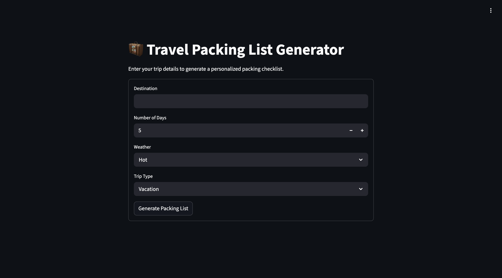

# 🧳 Travel Packing List Generator

A simple and interactive **Travel Packing List Web Application** built using **Python and Streamlit**.

The application generates a customized packing checklist based on **trip duration, weather conditions, and trip type**.
Users can review suggested items, uncheck items they don't need, and download the final packing list.

---

# 🚀 Live Demo

Try the application instantly without installing anything.

# 📸 Application Preview



🌐 **Live Website:**
https://travel-packing-list.onrender.com/

---

# 🔥 Features

* 🧠 Smart packing suggestions based on trip details
* 🌦 Weather-based recommendations (Hot / Cold / Rainy)
* 🧳 Different suggestions for **Vacation, Business, and Adventure trips**
* 📋 Organized packing checklist with categories:

  * Essentials
  * Clothing
  * Trip Gear
  * Daily Clothing
* ✅ Users can select or deselect suggested items
* 📄 Download selected items as a **formatted packing list**
* 🌐 Fully deployed online using **Render**

---

# 🧰 Technologies Used

* Python 3
* Streamlit
* Render (Deployment)

---

# ▶️ How to Run This Project

You can run this project in **three different ways**.

---

## 1️⃣ Run the Live Demo (Recommended)

Simply open the deployed website:

https://travel-packing-list.onrender.com/

No installation required.

---

## 2️⃣ Clone the Repository (Developer Method)

Clone the project using Git:

```bash
git clone https://github.com/Majji-Rohit/travel-packing-list.git
```

Move into the project folder:

```bash
cd travel-packing-list
```

Install required libraries:

```bash
pip install -r requirements.txt
```

Run the application:

```bash
streamlit run app.py
```

Open in browser:

```
http://localhost:8501
```

---

## 3️⃣ Download ZIP and Run (Beginner Method)

1. Open the GitHub repository
2. Click **Code → Download ZIP**
3. Extract the ZIP file
4. Open the folder in terminal or VS Code

Install dependencies:

```bash
pip install -r requirements.txt
```

Run the application:

```bash
streamlit run app.py
```

Open in browser:

```
http://localhost:8501
```

---

# 📂 Project Structure

```
travel-packing-list/
├── app.py            # Main Streamlit application
├── requirements.txt  # Python dependencies
└── README.md         # Project documentation
```

---

# 📌 Future Improvements

* Export packing list as **PDF**
* Save previous packing lists
* Integrate weather API for real-time weather
* Improve mobile UI experience

---

# 📃 License

Free to use for **personal and educational purposes**.
